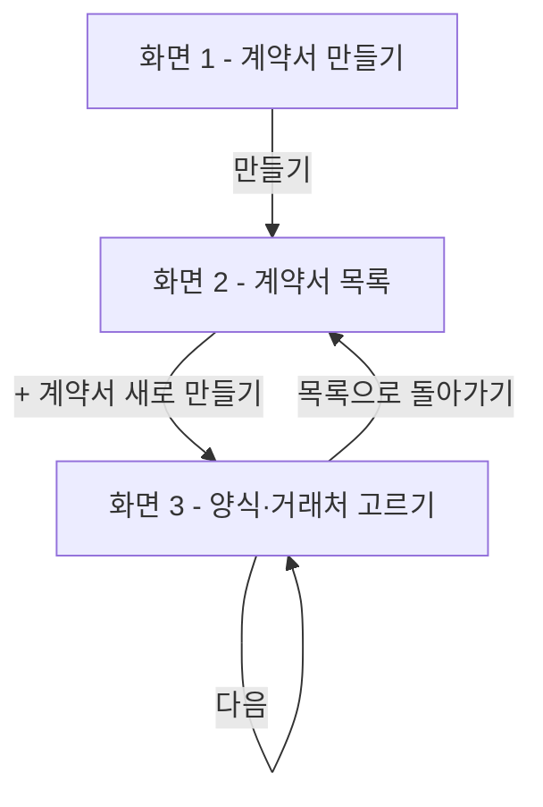

# 화면 흐름도

```mermaid
flowchart TD
    S1["화면 1 - 계약서 만들기"]
    S2["화면 2 - 계약서 목록"]
    S3["화면 3 - 양식·거래처 고르기"]

    S1 -->|만들기| S2
    S2 -->|"+ 계약서 새로 만들기"| S3
    S3 -->|목록으로 돌아가기| S2
    S3 -->|다음| S3
```
